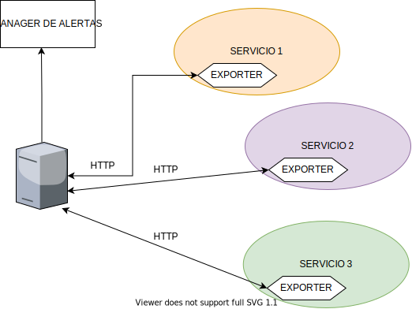
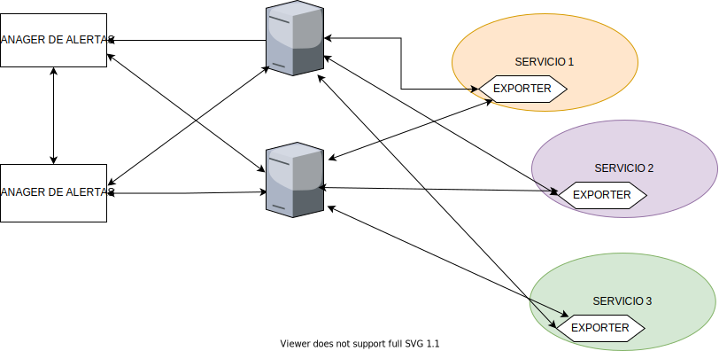

Informacion de Prometheus e Instalacion Parte 2


# Pasado de Prometheus

Google para correr sus diversos productos construyo BORG, es un cluster manager que ejecuta cientos de miles de trabajos. Kubernetes se inspira en  BORG, ademas construyeron la herramienta "BORG Mon" enfocoda a monitorizar el sistema BORG. El creador de Prometheus se inspiro en "BORG Mon". Borg mon esta desarrollado por un desarrollador ex de google, que se habia unido a soundcloud y lo empezaron a desarrollar internamente en Soundcloud. En 2015 hicieron su primer lanzamiento publico.


Soundcloud fue un "early adopter" de los patrones de arquitectura de microservicios. Para monitorizar un cloud dinamico basado en microservicios, fue construido Prometheus para responder a esas necesidades. Generalmente se suele utilizar Prometheus para monitorizar entornos basados en microservicios.

Prometheus esta enfocado en priorizar lo que esta pasanado ahora mismo, en lugar de lo que ha pasado hace semanas, meses o hacer una monitorizacion mas amplia en el tiempo. La monitorizacion de Prometheus se basa en datos generados recientemente. Facebook descubrio que el 85% de las querys par la monitorizacion se basaban en datos de menos de 26 horas. La mayor parte de los datos que queremos ver seran recientes, esto se refleja en el lenguaje de querys que esta pensado en tener una retencion de datos muy corta o estan pensado sobre datos con una retencion muy corta.


# Arquitectura

Como ya hemos dicho antes, Prometheus trabaja haciendo pull de datos timeseries expuestos en aplicaciones. Tu aplicacion necesitas que la aplicacion exponga esos datos y prometheus los va a buscar. Esos datos estan expuestos via librerias de clientes o via proxies llamados `exporters` accesibles atraves de http. Por tanto tu aplicacion tiene que estar exponiendo esos datos.

Existen librerias de cliente para muchos lenguajes, frameworks y aplicaciones open source como apache, mysql... Prometheus tambien tiene un pushgateway para que reciba prometheus pequeños volumenes de datos, por ejemplo, datos que se han generado o que se envian desde sitios que no pueden ser contactados, como servidores que estan detras de un firewall o servidores que NO van a poder enviar datos.

Cada servicio estaria ejecutandose un exporter que va a ser contactado por prometheus para recoger los datos. Si tiene que enviar una alerta, lo hace atraves de un manager de alertas.



# Coleccion de metricas

Prometheus llama al origin de las metricas desde el cual las obtiene. Este puente se corresponde con un proceso HOST, por tanto, vas a ir a un punto con una url concreta: `ip_del_servidor/nombre_del_host/nombre_de_la_metrica` en otro punto puede estar la metrica de la memoria, cpu, etc... Osea que tiene que ir a rascar/obtener metrica a metrica.

Prometheus, en algunos casos, necesitara autentificacion para conectarse, se pueden crear grupos de targets, a los que se llama `jobs`, un `job` es un grupo de targets. Puedes tener un grupo de servidores que todos tienen la misma metrica expuesta y atacarias esos servidores para obtener esas metricas.

El resultado es que se obtienen los datos y se almacenan esos datos en el servidor prometheus, tambien puede ser enviados a un servidor externo o otra base de datos compatible con timeseries.

# Sistema de discovery

El discubrimento de recursos que pueden ser monitorizadas se pueden gestionar de diferentes formas:

- Ficheros estaticos: una lista de recursos estatica proveida directamente a Prometheus
- Ficheros dinamicos: descubrimiento basado en ficheros, por ejemplo, un fichero generado por ansible, puppet. Asi prometheus sabria que hay algo en la lista
- Descubrimiento automatico, para hacer querys de datos que estan guardados en consul, instancias de amazon, google, etc... o a traves de record dns donde se genera esa lista de recursos.

El servidor tambien puede hacer una query para agregar los datos y puede crear reglas que van a guardar esas queries de agregacion. Esto te permite crear nuevos datos timeseries de otros datos timeseries que ya existen. Por ejemplo, si calculos el rate y los ratios de un sistema de produccion donde sumas diferentes datos, la siguiente query sera almacenar esos datos que se van a sumar a los ya existentes.

Tambien puede definir reglas para alertas en base a criterios como el uso de cpu, memoria, etc.. eso lo hace atraves de un servidor separado al que llamamos alert manager. El alert manager puede gestionar, dirigir alertas a una variedad de destinos como por ejemplo, mandar un email cuando hay un problema.

# Queries

El servidor Prometheus viene con un lenguaje propio de queries que se llama PROMQL. Viene con un browser de expriones y con un interfaz grafico que podemos usar para explorar los datos almacenados en el servidor. Cada servidor de Prometheus esta diseñado para ser lo mas autonomo posible, y puede almacenar desde cientos a millones de metricas en formato timeseries.

El formato de almancenamiento de datos esta diseñado para mantener lo mas bajo posible el uso de disco y proveer una obtencion de datos rapida durante la query y agregacion de datos.

# Redundancia y alta disponibilidad



La redundancia se centra en la resilencia de las alertas mas que en la durabilidad de los datos, se recomienda desplegar servidores prometheus para propuestos especificos y equipos mas que un servidor unico monolitico.

Si quieres desplegar redudancia y alta disponibilidad, necesitas que dos servidores identicos obtengan los datos y que las alertas generadas sean gestionados por un manager de alertas con alta disponibilidades configurado para desduplicar alertas (para que no se envien dos veces). 

Nota: genera un trafico interno bastante alto


# Visualizacion de datos

La visualizacion se provee via expresiones construidas integradas con el dashboard GRAFANA, tambien soporta otros dashboards.

- Prometheus Expresion Browser
- Prometheus Console templates
- Grafana


# El modelo de datos de prometheus

Prometheus colecciona datos timeseries, para gestionar estos datos, tiene un tipo de datos multidimensional. Los datos timeseries combinan nombres timeseries y valores clave/valor, llamados labels o etiquetas. Estas etiquetas proveen dimensiones. Es parecido a cloudWatch.

Cada timeseries es identificado por la combinacion de: el nombre y las etiquetas asignadas. El nombre seria `cpu:nombre-instancia` es igual a las dimensions de cloudwatch. El nombre define lo que estamos guardando. El nombre puede contener letras ascii, numeros, guiones bajos y dos puntos.

Las etiquetas permiten a Prometehus un modelo de datos dimensional, añaden contexto a un dato especifico, por ejemplo, el `totalwebvisits`. Tiene etiquetas que podrian identificar el nombre de la visita, la ip del origin.

Ejemplo: 

```
total_website_visits
{
    site="App_cualquiera", # app
    location="ES",          # de donde viene la visita
    instance="servidor_web", # la instancia que corre la app
    job="web"
}
```

# Retencion de datos

Prometheus esta diseñado para monitorizacion cortas. Guarda 15 dias de datos, si quieres retener mas lo recomandado es enviar los datos a sistemas/plataformas de terceros.

# Seguridad

Prometheus puede ser configurado y desplegado de muchas maneras. Hace asumciones sobre la seguridad:

- Los usuarios no confiables(cualquiera) pueden acceder al servidor Prometheus y a los datos, pero solo los usuarios confiables(administrador, operadores, etc...) pueden modificar la configuracion. Pero no significa que desde casa podamos ver el promotheus de amazon, porque esta protegido por una red interna, etc..

# Ecosistema de Prometheus

El ecosistema es una coleccion de integraciones de herramientas open source.

- Servidor Prometheus, es el corazon del ecosistema.
- Manager de alertas para Prometheus.
- Coleccion de `exporters` (servicios instalados en las maquinas para que prometheus pueda pedir las metricas) para servidores web(apache, etc...), bases de datos (mysql, etc...)
- Librerias de clientes para instrumentalizar aplicaciones. 


